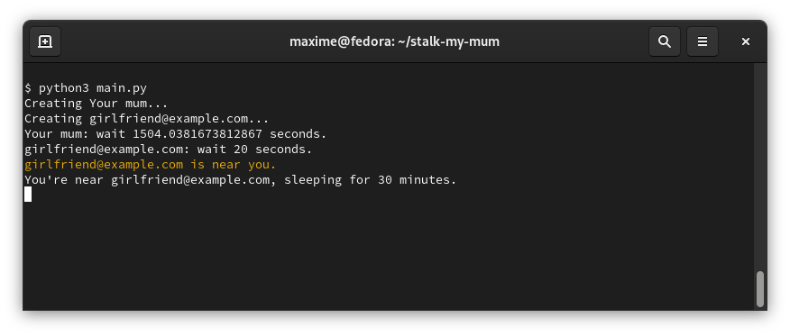

# Stalk My Mum

Stalk My mum alerts you if one of your Apple Find My's friend is within 2 km of you. 

## Table of contents
* [Installation](#installation)
* [Usage](#syntax)

## Installation
Python 3.7+ is needed.

```
git clone https://github.com/Math3mat1x/stalk-my-mum
cd stalk-my-mum/
pip3 install -r requirements.txt
```

## Usage

Fill in settings.py with your Apple credentials.
Run the main.py script. If you have activated 2 Factor Authentification, it will prompt you for your code.

By default, the program outputs everything in your terminal and if a friend is near you, it will be dispalyed in yellow.
If you want to use an external program to notify you, for instance with [orange_sms](https://github.com/Math3mat1x/orange_sms), modify the stalk-my-mum/alert.py file.

You might want to run main.py inside a Tmux Session.


